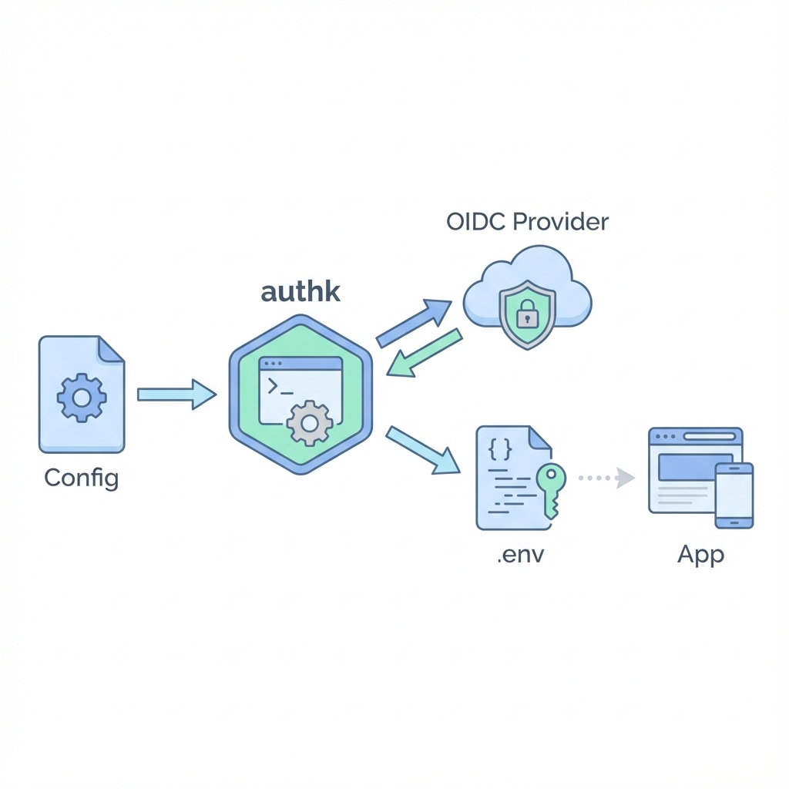

# authk

[](https://goreportcard.com/report/github.com/codozor/authk)

[](https://coveralls.io/github/codozor/authk)


`authk` is a CLI tool designed to establish and maintain an OIDC connection. It automatically updates a `.env` file with a valid access token, ensuring your development environment always has fresh credentials.
 


## Features

- **OIDC Integration**: Supports Client Credentials and Resource Owner Password Credentials flows.
- **Automatic Refresh**: Monitors token expiration and refreshes it automatically.
- **.env Management**: Updates a specific key in your `.env` file with the new token.
- **Configurable**: Uses CUE for flexible and type-safe configuration.

## Installation

```bash
go install github.com/codozor/authk/cmd/authk@latest
```

Or build from source:

```bash
git clone https://github.com/codozor/authk.git
cd authk
go build -o authk ./cmd/authk
```

## Configuration

`authk` uses a CUE configuration file (default: `authk.cue`).

Create a `authk.cue` file with your OIDC provider details:

```cue
package config

oidc: {
	issuerUrl:    "https://your-oidc-provider.com"
	clientId:     "your-client-id"
	clientSecret: "your-client-secret"
	// scopes: ["openid", "profile", "email"] // Optional, default shown
	// authMethod: "basic" // Optional, "basic" or "post", default is "basic"
}

// Optional: For Resource Owner Password Credentials flow
user: {
	username: "your-username"
	password: "your-password"
}

// Optional: Key to update in .env (default: "TOKEN")
tokenKey: "MY_TOKEN"
```

## Configuration Examples

### Keycloak

```cue
package config

oidc: {
	issuerUrl:    "https://keycloak.example.com/realms/myrealm"
	clientId:     "my-client"
	clientSecret: "my-secret"
}

user: {
	username: "myuser"
	password: "mypassword"
}
```

### Authentik

```cue
package config

oidc: {
	issuerUrl:    "https://authentik.example.com/application/o/my-app/"
	clientId:     "my-client-id"
	clientSecret: "my-client-secret"
	scopes:       ["openid", "profile", "email", "goauthentik.io/api"]
}
	scopes:       ["openid", "profile", "email", "goauthentik.io/api"]
}
```

## Secrets Management

`authk` integrates with [vals](https://github.com/helmfile/vals) to support loading secrets securely from various sources. You can use special URI schemes in your configuration file to reference secrets instead of hardcoding them.

Supported schemes:
*   `ref+env://` - Environment variables
*   `ref+file://` - File contents
*   `ref+sops://` - Files encrypted with [SOPS](https://github.com/getsops/sops)
*   `ref+k8s://` - Kubernetes Secrets

### Examples

**Environment Variables:**

```cue
oidc: {
    // ...
    clientSecret: "ref+env://OIDC_CLIENT_SECRET"
}
```

**Kubernetes Secret:**

```cue
user: {
    // ...
    // format: ref+k8s://namespace/secret-name/json-key
    password: "ref+k8s://default/my-secret/password"
}
```

**File Content:**

```cue
oidc: {
    // ...
    clientSecret: "ref+file:///path/to/secret_file"
}
```

## File Discovery

`authk` employs a smart discovery mechanism for both the configuration file (`authk.cue`) and the `.env` file. It searches in the following order:

1.  **Explicit Path**: If provided via flags (`--config`, `--env`).
2.  **Current Directory**: Checks the current working directory.
3.  **Parent Directories**: Walks up the directory tree to the root.
4.  **Home Directory**: Checks the user's home directory (`$HOME`).

This allows you to run `authk` from any subdirectory within your project or rely on a global configuration in your home directory.

## Usage

### Maintain Token (Long-running)

This is the main mode. It fetches a token, updates the `.env` file, and keeps running to refresh the token before it expires.

```bash
./authk --env .env
```

**Flags:**
- `--config`: Path to config file (default: `authk.cue`)
- `--env`: Path to .env file (default: `.env`)
- `--debug`: Enable debug logging

### Get Token (One-off)

Fetches a valid token and prints it to stdout. Useful for piping to other commands.

```bash
./authk get
```

### Inspect Token

Reads the current token from the `.env` file and displays its decoded content (Header and Payload).

```bash
./authk inspect
```

**Flags:**
- `--json`: Output as valid JSON without colors (useful for parsing)

## License

MIT
